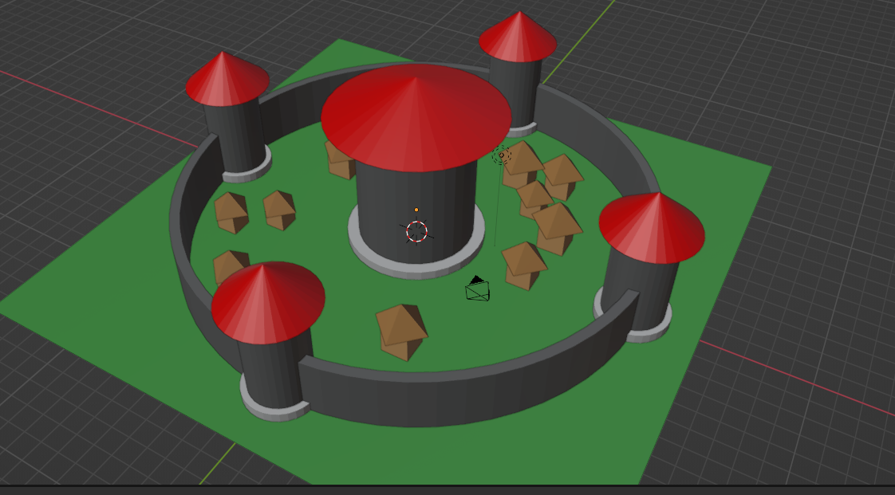
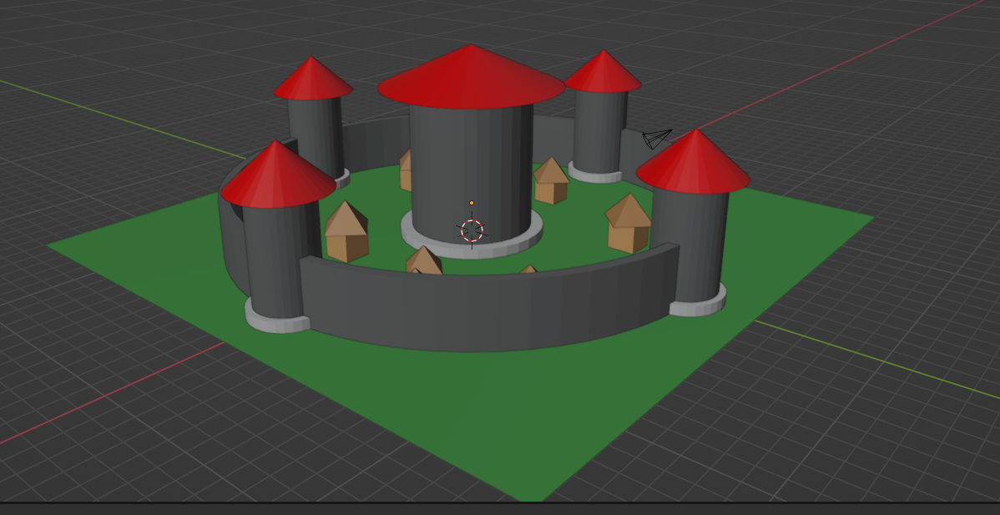

# Castle Generator

This Blender Python script generates a simple castle scene, including a central castle, corner towers, a wall, village houses, a ground plane, and an iron door. The script is compatible with Blender and uses its built-in Python API to create and manipulate mesh objects.
## Preview

## Usage

1. Open Blender and create a new Blender file.
2. Open the `Scripting` workspace.
3. Click on `Open` and select the `castle_generator.py` script.
4. Run the script by clicking the `Run Script` button or by pressing `Alt + P` in the text editor.

The script will generate a castle scene in the current Blender file.

## Objects Created

- Central castle
- Corner towers
- Wall
- Village houses
- Ground plane
- Iron door

## Customization

You can customize the script by changing the various parameters, such as:

- Wall radius, height, and thickness
- Tower radius, height, and base height
- House count and size
- Ground plane size
- Door size and location

Modify these parameters directly in the `castle_generator.py` script to generate different castle scenes.
